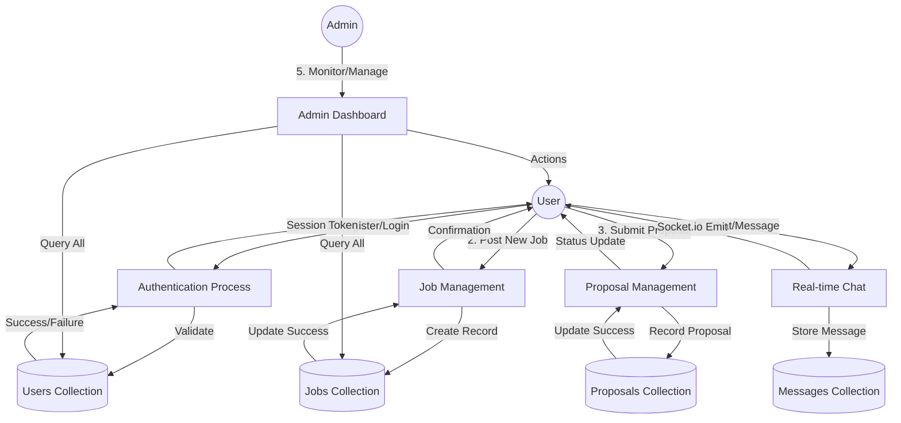
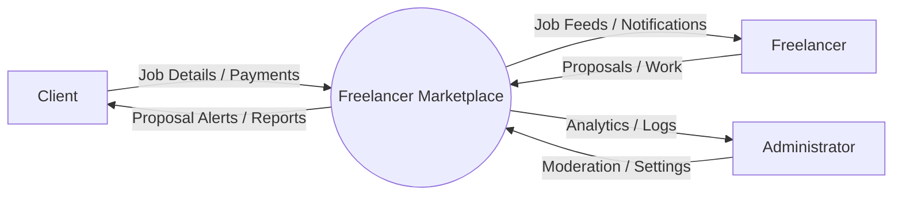
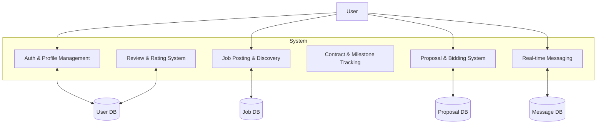

# Comprehensive Project Documentation: Freelancer Marketplace

---

## 1. Introduction

### 1.1 Overview of the Freelance Ecosystem

The global economy is witnessing a paradigm shift from traditional 9-to-5 employment toward a decentralized, flexible "Gig Economy." This transformation is driven by the rapid advancement of digital communication technologies and a growing desire among professionals for autonomy and work-life balance. Freelancing platforms serve as the digital town squares where this exchange of skills and capital occurs. However, as the market matures, the need for specialized, secure, and transparent marketplaces becomes paramount.

The **Freelancer Marketplace** project is conceived as a robust, scalable solution designed to facilitate this modern work arrangement. It aims to provide a seamless interface where businesses (Clients) can find verified talent (Freelancers) to execute projects efficiently.

### 1.2 Evolution and Context

Historically, freelance work was conducted through personal networks or classified ads. The first generation of online marketplaces introduced the concept of global reach but suffered from high friction in payments and low trust. The current generation of platforms, while technologically advanced, often prioritizes corporate profit over user experience, leading to exorbitant service fees and complex dispute resolution processes that favor neither party.

This project addresses these historical challenges by leveraging modern web technologies—specifically the MERN stack (MongoDB, Express, React, Node)—complemented by real-time capabilities via Socket.io and secure authentication through Firebase.

### 1.3 Existing System Analysis

The current landscape of freelance marketplaces can be categorized into three tiers:

1.  **Global Giants:** Platforms like Upwork and Toptal. They offer massive reach but are plagued by high competition, steep entry barriers for new talent, and commission rates that can reach up to 20-30%.
2.  **Specialized Portals:** Sites like Behance or GitHub (Jobs), which focus on specific niches. While they offer high-quality leads, they often lack integrated project management and secure payment escrow tools.
3.  **Informal Channels:** Social media groups (LinkedIn, Reddit, Facebook) and local ads. These offer the lowest fees but the highest risk of fraud, with no formal contracts or dispute mechanisms.

### 1.4 Limitations of the Existing System

- **Economic Barriers:** High platform fees significantly reduce the net income of freelancers and increase costs for clients.
- **Trust Deficit:** Lack of transparent, immutable work history makes it difficult for new but skilled freelancers to secure their first project.
- **Communication Silos:** Most platforms force users to communicate through proprietary, often clunky, messaging systems or risk being banned for "going off-platform."
- **Complexity Overload:** Many existing systems are over-engineered, with bloated interfaces that distract from the primary goal: getting work done.
- **Payment Insecurity:** Delays in payment processing and lack of milestone-based releases often lead to cash flow issues for freelancers.

---

## 2. Proposed System

### 2.1 Project Profile

The **Freelancer Marketplace** is a comprehensive, full-stack application designed to manage the entire lifecycle of a freelance engagement. From identity verification and job posting to real-time chat, contract management, and performance reviews, the system provides a unified environment for professional collaboration.

- **Project Name:** Freelancer Marketplace (Professional Edition)
- **Architecture:** Client-Server (REST API + WebSockets)
- **Front-end:** React.js (TypeScript), Vite, Tailwind CSS
- **Back-end:** Node.js, Express.js
- **Database:** MongoDB (Atlas)
- **Real-time Layer:** Socket.io
- **Authentication:** Firebase Admin SDK / JWT

### 2.2 System Objectives

The primary objectives of the proposed system are:

1.  **Role-Based Access Control (RBAC):** Implementing distinct workflows for Clients, Freelancers, and Administrators to ensure data security and functional clarity.
2.  **Job Lifecycle Management:** Automating the transition of a job from 'Posted' to 'In Progress', 'Completed', and 'Archived'.
3.  **Bid/Proposal Transparency:** Allowing freelancers to submit detailed proposals including timeframes and budget breakdowns.
4.  **Integrated Communication:** Providing a real-time chat system that persists message history and enables instant project updates.
5.  **Verified Reviews:** Creating a trust-based ecosystem where both parties are rated upon project completion, preventing "review gaming."
6.  **Admin Governance:** Empowering administrators with tools to monitor platform activity, manage user accounts, and resolve potential disputes.

### 2.3 Hardware and Software Requirements

#### 2.3.1 Hardware Requirements (Development & Client)

- **Processor:** Quad-core Intel Core i5 / AMD Ryzen 5 or higher to handle concurrent frontend and backend development environments.
- **Memory (RAM):** 8 GB minimum (16 GB recommended for smooth execution of Docker and multiple VS Code instances).
- **Storage:** 256 GB SSD (Solid State Drive) for fast file I/O operations.
- **Network:** Stable broadband connection (min 10 Mbps) for cloud database synchronization and API testing.

#### 2.3.2 Software Requirements

- **Operating System:** Windows 10/11, macOS Monterey+, or Ubuntu 20.04 LTS.
- **Runtimes:** Node.js v20.x (LTS) or higher.
- **Database Management:** MongoDB Compass for local visualization; MongoDB Atlas for production.
- **Development Tools:**
  - Visual Studio Code (with ESLint and Prettier extensions).
  - Postman or Insomnia for API testing.
  - Git for version control.
- **Libraries/Frameworks:**
  - **Frontend:** React 18, TanStack Query (for data fetching), Lucide React (icons).
  - **Backend:** Express 5.x, Mongoose 9.x, Multer (file uploads), Bcrypt (password hashing).

### 2.4 Feasibility Study

Before proceeding with the implementation, a three-pronged feasibility study was conducted:

1.  **Technical Feasibility:** The MERN stack is industry-standard for scalable web apps. The availability of Firebase for secure auth and Socket.io for real-time features ensures that all functional requirements can be met without building everything from scratch.
2.  **Economic Feasibility:** The system utilizes open-source technologies (MIT/ISC licenses). Hosting costs are minimized through free-tier cloud services (MongoDB Atlas, Vercel/Render, Firebase) for the initial prototype phase.
3.  **Operational Feasibility:** The user interface is designed with a "mobile-first" approach, ensuring that users with varying levels of technical expertise can navigate the platform with minimal training.

---

## 3. System Design

### 3.1 Architecture Overview

The system follows a modular **Service-Controller-Model** architecture on the backend. This ensures a strict separation of concerns:

- **Models:** Define the data structure and business rules (via Mongoose schemas).
- **Services:** Contain the core business logic (e.g., calculating ratings, processing job status transitions).
- **Controllers:** Handle incoming HTTP requests, validate input, and invoke services.
- **Middleware:** Manage cross-cutting concerns like authentication, role verification, and error handling.

### 3.2 System Level Diagram

The diagram below expands on the core interactions, showing how the system processes high-level requests across the User, Process, and Data layers.

### 3.3 Data Flow Diagrams (DFD)

#### Level 0: Context Diagram

This diagram shows the system as a single process and its interactions with external entities.

#### Level 1: Process Overview

Expanding the Level 0 process into major sub-processes.

### 3.4 Data Dictionary

The Data Dictionary provides a detailed breakdown of every attribute within the system's primary collections.

#### 3.4.1 User Collection (`users`)

| Attribute        | Data Type | Description                          | Validation                              |
| :--------------- | :-------- | :----------------------------------- | :-------------------------------------- |
| `_id`            | ObjectId  | Primary Key                          | Auto-generated                          |
| `username`       | String    | Unique handle for identification     | Required, 3-30 chars, No spaces         |
| `fullname`       | String    | User's legal name                    | Required, Max 100 chars                 |
| `email`          | String    | Communication and login address      | Required, Unique, Email format          |
| `password`       | String    | Hashed representation of password    | Required, Min 6 chars (Bcrypt)          |
| `role`           | String    | User permission level                | Enum: ['client', 'freelancer', 'admin'] |
| `profilePicture` | String    | URL to stored image (Firebase/Local) | Optional, URL format                    |
| `clientRating`   | Number    | Average rating given by freelancers  | 0 to 5, Default 0                       |
| `refreshToken`   | String    | Token for session persistence        | JWT String or Null                      |

#### 3.4.2 Job Collection (`jobs`)

| Attribute     | Data Type     | Description                     | Validation                                 |
| :------------ | :------------ | :------------------------------ | :----------------------------------------- |
| `_id`         | ObjectId      | Primary Key                     | Auto-generated                             |
| `client`      | ObjectId      | Reference to User (Client)      | Required, Valid User ID                    |
| `title`       | String        | Brief summary of the task       | Required, 10-100 chars                     |
| `description` | String        | Full project requirements       | Required                                   |
| `difficulty`  | String        | Required expertise level        | Enum: ['entry', 'intermediate', 'expert']  |
| `budget`      | Number        | Allocated funds for the project | Required, > 0                              |
| `budgetType`  | String        | Payment structure               | Enum: ['fixed', 'hourly']                  |
| `status`      | String        | Current lifecycle stage         | Enum: ['open', 'in_progress', 'completed'] |
| `skills`      | Array[String] | List of required tags           | Max 10 tags                                |

#### 3.4.3 Proposal Collection (`proposals`)

| Attribute     | Data Type | Description                  | Validation                                |
| :------------ | :-------- | :--------------------------- | :---------------------------------------- |
| `_id`         | ObjectId  | Primary Key                  | Auto-generated                            |
| `job`         | ObjectId  | Reference to the Job post    | Required                                  |
| `freelancer`  | ObjectId  | Reference to the applicant   | Required                                  |
| `bidAmount`   | Number    | Proposed price by freelancer | Required, > 0                             |
| `coverLetter` | String    | Pitch to the client          | Required, Min 50 chars                    |
| `status`      | String    | Proposal state               | Enum: ['pending', 'accepted', 'rejected'] |

### 3.5 Data Tables

#### Table: Users

| Field       | Type         | Constraint       | Description                                      |
| :---------- | :----------- | :--------------- | :----------------------------------------------- |
| `username`  | VARCHAR(30)  | UNIQUE, NOT NULL | Unique identifier for mentions and profile URLs. |
| `email`     | VARCHAR(255) | UNIQUE, NOT NULL | Used for login and transactional emails.         |
| `role`      | ENUM         | DEFAULT 'client' | Determines dashboard access and UI features.     |
| `createdAt` | TIMESTAMP    | DEFAULT CURRENT  | Automatic audit trail for account age.           |

#### Table: Jobs

| Field       | Type          | Constraint     | Description                                |
| :---------- | :------------ | :------------- | :----------------------------------------- |
| `title`     | VARCHAR(100)  | NOT NULL       | Displayed in job feeds and search results. |
| `client_id` | FK (Users)    | NOT NULL       | Links the job to the posting entity.       |
| `budget`    | DECIMAL(10,2) | NOT NULL       | The financial value of the contract.       |
| `status`    | VARCHAR(20)   | DEFAULT 'open' | Controls visibility to freelancers.        |

#### Table: Contracts

| Field           | Type          | Constraint | Description                              |
| :-------------- | :------------ | :--------- | :--------------------------------------- |
| `job_id`        | FK (Jobs)     | NOT NULL   | The specific job this contract fulfills. |
| `freelancer_id` | FK (Users)    | NOT NULL   | The talent hired for the task.           |
| `startDate`     | DATE          | NOT NULL   | Official commencement of work.           |
| `totalAmount`   | DECIMAL(10,2) | NOT NULL   | Final agreed price.                      |

---

## 4. Screen Layouts

_(Section intentionally omitted as per instructions)_

---

## 5. Future Enhancement

### 5.1 Short-Term Improvements (Next 6 Months)

- **Two-Factor Authentication (2FA):** Enhancing security by requiring an SMS or App-based code for withdrawals and sensitive account changes.
- **File Versioning:** Integrated version control for project deliverables, allowing clients to see the evolution of the work.
- **Video Conferencing:** Built-in WebRTC support for live video interviews within the platform to eliminate the need for Zoom or Google Meet.

### 5.2 Long-Term Strategic Goals

- **AI-Driven Talent Curation:** Implementing a recommendation engine that analyzes freelancer portfolios and job requirements to suggest the "Best Match" for clients.
- **Blockchain Smart Contracts:** Moving from traditional database-backed contracts to Ethereum or Solana smart contracts to automate escrow releases based on predefined milestones.
- **Mobile Ecosystem:** Developing native Android and iOS applications to provide push notifications and mobile project management.
- **Global Localization:** Translating the platform into 20+ languages and supporting local payment methods across Africa, Asia, and Latin America to foster a truly global workforce.
- **Enterprise Features:** Dedicated tools for large organizations, including team management, bulk billing, and specialized procurement workflows.

---

## 6. References

### 6.1 Documentation & APIs

- **MongoDB Mongoose Documentation:** [https://mongoosejs.com/docs/](https://mongoosejs.com/docs/) - Detailed reference for schema definitions and population.
- **React Router Documentation:** [https://reactrouter.com/](https://reactrouter.com/) - Core resource for implementing the application's SPA navigation logic.
- **Express.js API Reference:** [https://expressjs.com/en/4x/api.html](https://expressjs.com/en/4x/api.html) - Documentation for middleware and routing patterns.
- **Firebase Admin SDK Guide:** [https://firebase.google.com/docs/admin/setup](https://firebase.google.com/docs/admin/setup) - Instructions for secure server-side authentication.

### 6.2 Industry Standards

- **OWASP Top 10 Security Project:** [https://owasp.org/www-project-top-ten/](https://owasp.org/www-project-top-ten/) - Guidelines used for implementing security headers and sanitizing user input.
- **W3C Web Content Accessibility Guidelines (WCAG):** [https://www.w3.org/WAI/standards-guidelines/wcag/](https://www.w3.org/WAI/standards-guidelines/wcag/) - Reference for ensuring the UI is usable by people with disabilities.
- **RESTful API Design Best Practices:** [https://restfulapi.net/](https://restfulapi.net/) - Standard used for structuring the backend endpoints.
